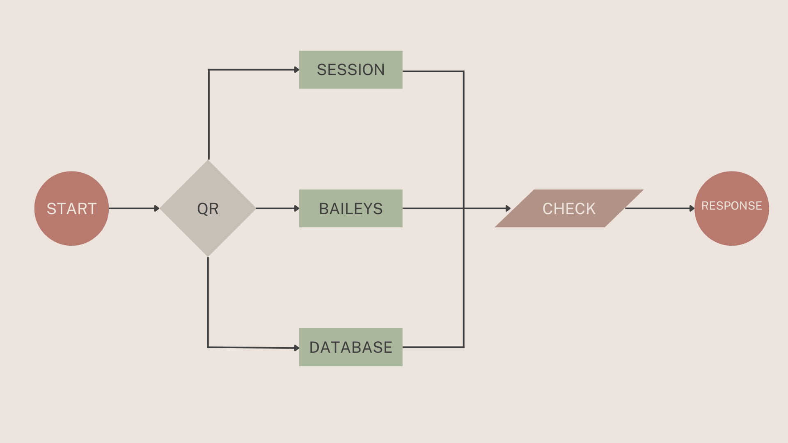
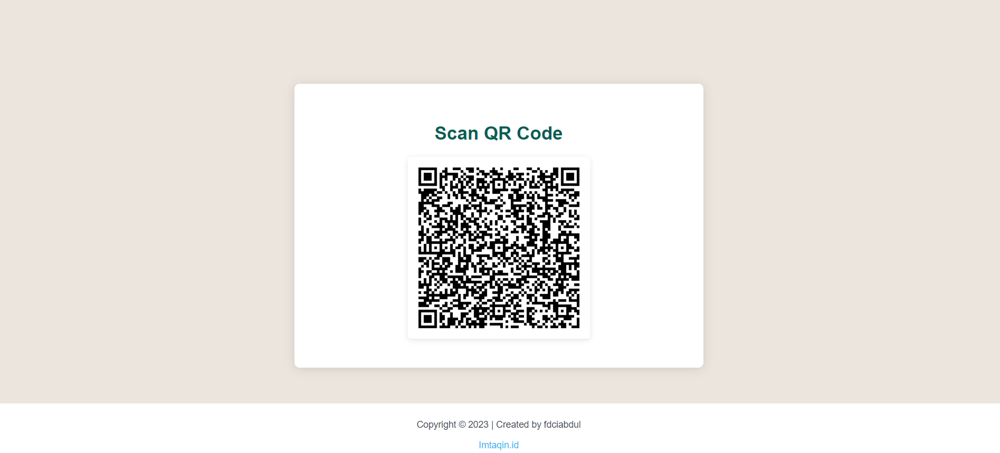

<p align="center">
  
</p>

<h1 align="center">Whatsapp Number Checker API</h1>

<p align="center">
  A brief description of what your project does.
</p>

<p align="center">
  <!-- You can add badges here if you like -->
</p>

---

**Table of Contents**
- [Introduction](#introduction)
- [Features](#features)
- [Installation](#installation)
- [Usage](#usage)
- [Contributing](#contributing)
- [License](#license)
- [Contact](#contact)

## About

[Back to top](#table-of-contents)

Maybe you searching for this one right?
this is free , no cost , no susbscription


## Features

[Back to top](#table-of-contents)

- Multi Account
- Handling session
- Easy to use

## Installation

[Back to top](#table-of-contents)

first clone this repository

```bash
> git clone https://github.com/imtaqin/wacheck
> cd wacheck
> npm install
> npm start
```

## Usage

[Back to top](#table-of-contents)

- Open website in `localhost:3000`

- it'll show like this
 

- Scan the QR code

- if it's show the message connection success , then you successfully connected the device to the server

### Check the number

make request `GET` to `localhost:3000/check-number/<phone>`

then you will get the response 

```json
{
"number": "xxxxxx",
"status": true
}
```


